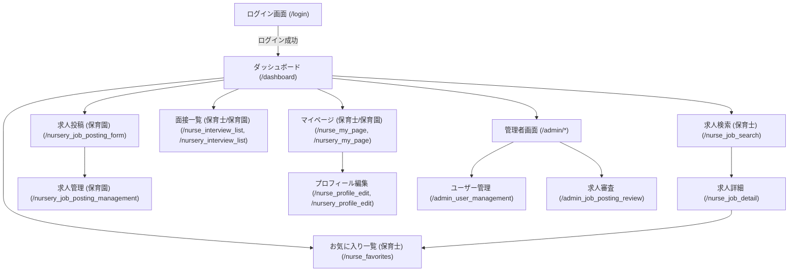
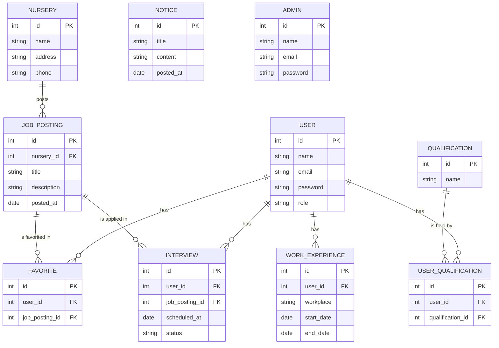

# Childcare Matching App

保育士と保育園をマッチングするためのWebアプリケーションのバックエンドです。  
Spring Boot を用いて構築されています。

## 主な機能

- 保育士・保育園のユーザー登録・認証
- 求人情報の投稿・検索・詳細表示
- お気に入り登録
- 面接管理
- 管理者によるユーザー・求人管理
- プッシュ通知機能
- CSVエクスポート

## ディレクトリ構成

```
src/main/java/com/matchingapp/
  ├── config/         # セキュリティ設定
  ├── controller/     # 各種コントローラー
  ├── entity/         # エンティティ（DBモデル）
  ├── repository/     # リポジトリ（DBアクセス）
  ├── service/        # サービス層
src/main/resources/
  ├── static/         # 静的ファイル（CSS, JS等）
  ├── templates/      # Thymeleafテンプレート
  ├── application.properties # 設定ファイル
  ├── schema.sql      # DBスキーマ
  ├── data.sql        # 初期データ
```

## セットアップ方法

### 前提

- Java 17 以上
- Maven 3.8 以上
- MySQL などのRDBMS（H2等でも可）

### ビルド & 実行

1. リポジトリをクローン
    ```sh
    git clone <このリポジトリのURL>
    cd childcare-matching-app
    ```

2. データベース設定  
   `src/main/resources/application.properties` を編集し、DB接続情報を設定してください。

3. ビルド
    ```sh
    mvn clean package
    ```

4. アプリケーション起動
    ```sh
    mvn spring-boot:run
    ```
    または
    ```sh
    java -jar target/childcare-matching-app-0.0.1-SNAPSHOT.jar
    ```

5. ブラウザでアクセス  
   `http://localhost:8080/` でアプリケーションにアクセスできます。

## 主要なエンドポイント

- `/login` : ログイン画面
- `/register_nurse` : 保育士登録
- `/register_nursery` : 保育園登録
- `/dashboard` : ユーザーダッシュボード
- `/admin/*` : 管理者用画面

## 画面遷移図



## ER図



## ライセンス

このプロジェクトはMITライセンスの下で公開されています。 

---

## 🛠️ 技術スタック

| 種類         | 使用技術・サービス         |
|:-------------|:--------------------------|
| 言語         | Java  <br> HTML  |
| フレームワーク | Spring Boot, Thymeleaf    |
| DB           | PostgreSQL, H2 (開発用)   |
| ビルド       | Maven                     |
| その他       | JPA, Spring Security, etc.|

---

## 🤝 コントリビューション

Pull Request・Issueは大歓迎です！  
バグ報告・機能提案・ドキュメント修正など、どなたでもお気軽にご参加ください。

1. Issueを立ててください
2. Forkしてブランチを作成
3. コード修正後、Pull Requestを送信

---

## 📬 連絡先

- 作者: [吉永　歩]
- お問い合わせ: [yay2024@llc-yay.com]
- [GitHub Issues](https://github.com/yoshiayu/childcare-matching-app/issues) からもご連絡ください

--- 
